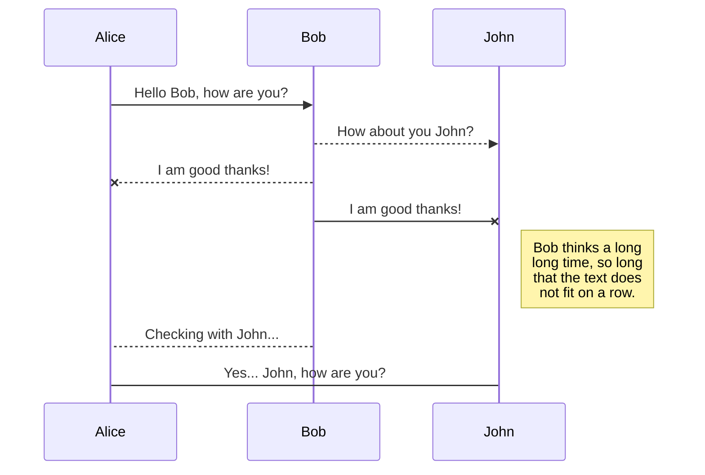
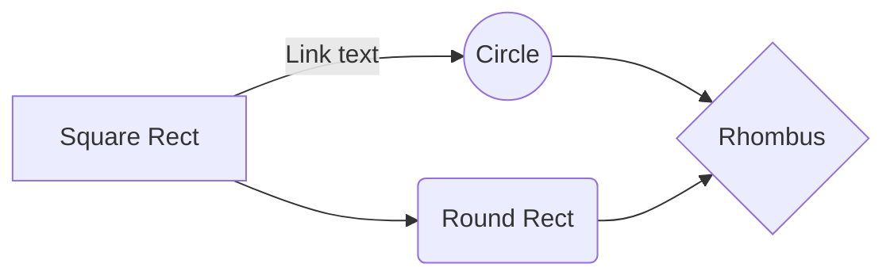

<section class="photoset">
  <div class="photoset-row">
    <figure class="photoset-item single feature-" data-pswp-uid="1">
        <a href="#"></a>
    </figure>
  </div>
  <div class="caption">A USB-C f YubiKey 5C security key plugged into my ThinkPad X1 Carbon</div>
</section>

<pre class="not-prose">
<code>
# Run as root
apt install awscli
</code>
</pre>

<a href="https://docs.railway.app/reference/regions#region-options" target="_blank" rel="noreferrer" >service region</a>

<p class="double">This text has a wavy red line beneath it.</p>

<p><code class="contentfulRichText_code__RWBxk">cmd/ctrl</code></p>

<h2 class="hdgSec02">研究手法と成果</h2>


[](https://bookmark.style)

```python
# Example of code highlighting
input_string_var = input("Enter some data: ")
print("You entered: {}".format(input_string_var))
```






  Incididunt labore eiusmod culpa eu nostrud tempor laborum consequat eiusmod excepteur.


<p class="has-dropcap">
<span aria-labelledby="word--first" role="text">
 <span aria-hidden="true">
  <span class="dropcap">我</span>
 </span>
</span>
became enthralled about this when I was planning for my 2013 trip to Japan. I came back with thousands of photos and spent months figuring out a way to best share the story of the trip on this site. I designed and developed the first version of my photoset collections then.
</p>

<div class="content-module yellow">
  <div class="header">
    <h4 class="toc" id="updates">Updates</h4>
    <p class="metasub">Jan 2020</p>

  </div>
    <p>There have been quite a few updates—really good updates—in the security key world since I published this article in October 2019. I have updated the respective sections throughout this article, but also wanted to note them in one place here:</p>
    <h6 class="top-2">Jun 2019</h6>
<ul>
      <li>
        <p><strong><a href="https://s#" title="#">Google has added WebAuthn support on iOS!</a></strong> 这是个真实的. The <a href="https://#/" title="#">Yubico post</a> has additional context.</p>
      </li>
    </ul>
    <h6 class="top-2">Jun 2018</h6>
<ul>
      <li>
        <p><strong><a href="https://#" title="#">Google has added WebAuthn support on iOS!</a></strong> 这是个真实的. The <a href="https://#/" title="#">Yubico post</a> has additional context.</p>
      </li>
    </ul>

</div>


<picture>
  <source srcset="https://www.koojiafeng.com/images/bg/bg.avif" type="image/avif">
  <source srcset="https://www.koojiafeng.com/images/bg/bg.webp" type="image/webp">
  
</picture>


<p>The only print books I have are basically just travel and coffee table books that serve more as decoration. <strong>If I read 24+ books a year and have no intention of reading them again, do I really want those books taking up space?</strong> If you really loved a particular book, then by all means purchase a print copy to display on your bookshelf. But not for me. <sup><a rel="footnote" href="#footnote-2" id="r2">2</a></sup></p>

<p>短消息发布<sup><a rel="footnote" href="#footnote-1" id="r1">1</a></sup></p>

Caramels tootsie roll I love macaroon jujubes. I love icing bonbon. Topping ice cream muffin marzipan lemon drops sugar plum biscuit. Chocolate cupcake powder macaroon bear claw I love cupcake icing. Jelly bear claw caramels jelly beans jelly-o soufflé. Powder cheesecake pastry lemon drops oat cake bonbon gummi bears. Jelly-o I love cake cupcake. I love halvah gummi bears caramels. Gummies I love gummies fruitcake cake marzipan. Oat cake donut cake brownie.

Test

You can render UML diagrams using [Mermaid](https://mermaidjs.github.io/). For example, this will produce a sequence diagram:



And this will produce a flow chart:


<div class="c-cmjOaN c-cmjOaN-cGSuyl-animateIn-true c-cmjOaN-ikRsAQh-css">
<span class="c-cSYTWC c-cSYTWC-hEuRwX-shape-large"><span aria-hidden="true" style="width: 100%; height: 100%; opacity: 0;"></span>
<span style="opacity: 1;">
    <div class="image-container">
        
    </div>
</span>
</div>

<blockquote>How to check if your doctor is listening: Before your appointment make a list of all the things you want to address. At the end of the meeting go through each item on your list to ensure everything has been addressed and has a plan of action. If something hasn’t been addressed bring it up again but one at a time. That way the doctor has no choice but to address each one.</blockquote>

<section name="footnotes" id="footnotes">
<h6 class="toc toc-hidden" id="fn">Footnotes</h6>
<p id="footnote-1"><a href="#r1">1</a> 当然这是验证</p>

<p id="footnote-2"><a href="#r2">2</a> And yes you can <a href="https://www.amazon.com/gp/help/customer/display.html?nodeId=200549320" title="Lend or Borrow Kindle Books">lend Kindle books to friends</a>. Amazon Prime members can also <a href="https://www.amazon.com/gp/help/customer/display.html?nodeId=200757120" title="Borrow Books from the Kindle Owners' Lending Library">borrow Kindle books directly from Amazon</a> (up to one per month) without needing to purchase them.</p>
</section>


<section class="story-content">
<div class="context-card">
<h6>TRAVELERS</h6>
<ul class="travelers">
<li><a href="#" target="_blank"></a><span>Koo</span></li>
<li><a href="#" target="_blank"></a><span>Koo</span></li>
<li><a href="#" target="_blank"></a><span>Koo</span></li>
<li><a href="#" target="_blank"></a><span>Koo</span></li>

</ul>
</div>

<div class="context-card">
    <h6>BEHIND THE SCENES</h6>
    <p>I'm trying something new with this photoset. I've made several compilations of various videos captured from my phone (as opposed to my <a href="#/" title="Camera Gear - #">large Sony camera</a>) like this one above. They are longer and don't autoplay, just click them to expand and play (and excuse any bugs..).</p>
  </div>
</section>
https://blog.douchi.space/static-blog-one-year-in-hugo-decoration-3/#gsc.tab=0